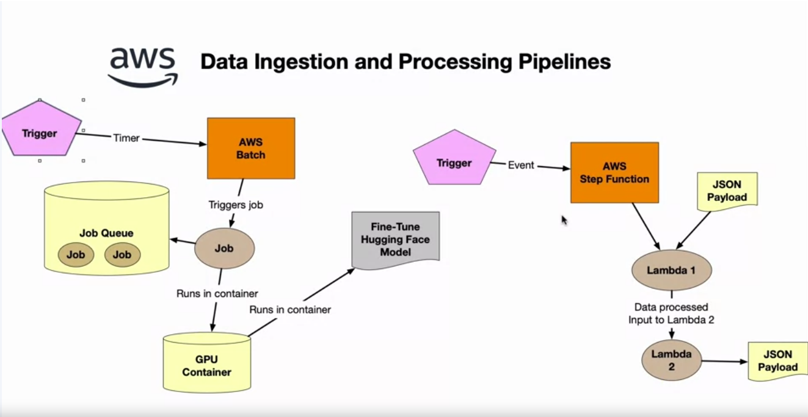
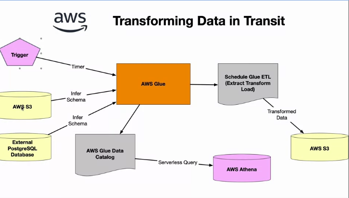
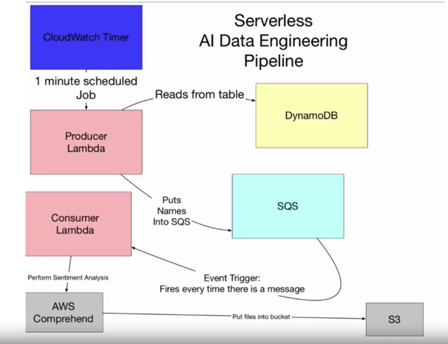

## Data Pipelines
- AWS Lambda + Stepfunctions
- Lambad function 
    - trigger
    - function
    - 
- boiler plate code  (Lambda function)
    ```
    import json

    def lambda_handler(event, context)
        # TODO implement
        return{
            'statusCode': 200,
            'body': json.dumps('Hello from Lambda!')
        }
    ```

## Query Databricks Pipeline
- Azure databricks

## Data ingestion pipeline (AWS)


## AWS Stepfunctions
- orchestrating jobs

## Transforming Data in Transit
- 

AWS Batch

## Serverless AI Data Engineering Pipeline

